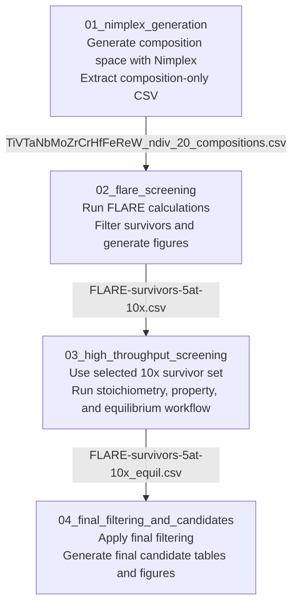

# IT2 Workflow

This directory documents the full `IT2` candidate-selection workflow from composition generation through final filtering.

## Prepared By

Samuel Ifada

## Pipeline Summary

1. Generate the composition space with Nimplex, extract the Nimplex parameters, and prepare the composition-only file.
2. Run the FLARE workflow on the composition-only file, including calculations, filtering, survivor sets, and plots.
3. Run high-throughput screening on the selected survivor level.
4. Apply the final filtering workflow and collect the final candidate outputs.

## Workflow Diagram

## Directory Guide

- `00_overview/`: high-level workflow notes, assumptions, and environment details.
- `01_nimplex_generation/`: composition generation inputs, scripts, and outputs.
- `02_flare_screening/`: FLARE calculations, filtering, survivor outputs, and plots.
- `03_high_throughput_screening/`: STOIC and CALPHAD screening for the selected survivor set.
- `04_final_filtering_and_candidates/`: final filtering and final candidate outputs for `IT2`.

## Current Notes

- The full FLARE survivor archive is not committed to the repository because of file-size limits.
- The selected `10x` survivor set used in `03_high_throughput_screening/` is stored as `03_high_throughput_screening/inputs/FLARE-survivors-5at-10x.csv`.
- Step 2 keeps the FLARE scripts, notebook, and summary plots, while Step 3 starts from the extracted `10x` survivor set.

## Recommended Use

Each step folder should contain:

- a short `README.md` describing the step,
- the relevant input files,
- scripts or notebooks used for the step,
- output tables or summary results that feed the next stage.

Keep large raw calculation outputs out of Git when possible. Prefer committing scripts, settings, reduced CSV outputs, and final summary tables.
